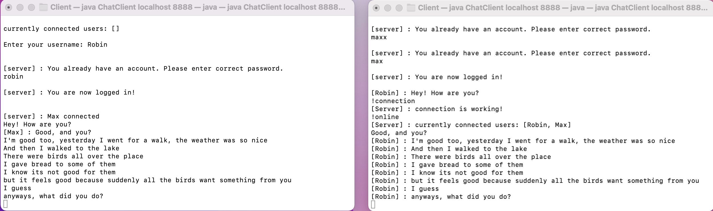
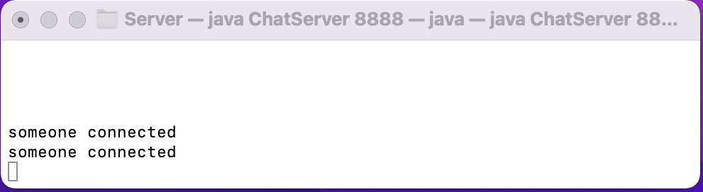

# chroom-cli
a minimal java chat server and client

key features:
- you can chat with others
- only one room
- password-protected accounts
- no encryption
- no error handling

This was created during a project at uni in one of the first semesters and has very messy (and probably buggy) code. <br>
There also is a follow-up application with more features and a gui. I might someday upload that too.



<p float="center">
  
</p>


### Usage

user commands:
```shell
!online       #lists other connected users
!connection   #checks if the connection is still alive
!quit         #closes the socket
```

start the server:
```shell
javac ChatServer.java
java ChatServer <port>
```

start the client:
```shell
javac ChatClient.java
java ChatClient <ip> <port>
```

### Implementation

vanilla java


